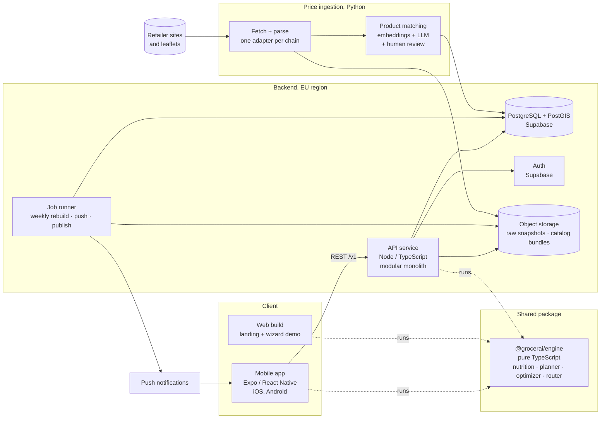

# Grocerai architecture

Draft v0.1, 11 September 2026. This is the high-level plan for turning the prototype in `index.html` into a product. It is written before the product decisions are made; wherever the plan depends on one, it is marked `[D#]` and the decision, the options and the recommended choice are in [decisions.xlsx](decisions.xlsx). The plan assumes the recommended options. If a decision goes the other way, the affected section is the only thing that changes.

The CEO summary is in [ceo-summary.pptx](ceo-summary.pptx).

## Pages

- This page: what the system does, principles, the system diagram, repository layout, the three key flows.
- [Frontend](frontend.md): app platform, structure, state model, offline, design system, quality.
- [Backend](backend.md): API, the engine, data model, price ingestion pipeline, weekly rebuild, security, observability.
- [Roadmap](roadmap.md): phases, team split, non-functional requirements, risks.

## What the system does

The prototype already defines the product as a pipeline. The architecture keeps it:

```
profile ─▶ kcal target ─▶ weekly meal plan ─▶ grocery list ─▶ priced at every store
        ─▶ cheapest store set + route ─▶ in-store shopping mode ─▶ progress
```

The user answers five wizard steps once. Every price week (Thursday for most Slovenian chains) the plan, list and route are rebuilt against fresh prices and the user is told what they save against their usual store. Everything downstream of the profile is computed, never authored by the user.

## Principles

1. **Derived, not stored.** The prototype's `model()` pattern is right: store the user's inputs (profile), their overrides (swaps, checked items, trip progress) and the catalog; compute the plan, list, optimisation and route from those with a pure engine. Snapshot what the user saw for history; never hand-edit derived data.
2. **Useful before the backend exists.** The app runs entirely on the device against a bundled catalog first, exactly as the prototype does. The backend appears when prices become real, accounts appear when sync becomes worth it. Value ships in phase 1, not phase 3.
3. **One language, one engine.** TypeScript in the app, the API and the engine; the engine is a shared package that runs on the phone and on the server. Python only in price ingestion, where its scraping and matching ecosystem wins. `[D5]` `[D11]`
4. **Modular monolith.** One API service with module boundaries that mirror the prototype's sections, so the two-developer, ownership-per-module rule in [collaboration](../collaboration/README.md) carries over unchanged. No microservices. `[D6]`
5. **EU only, privacy first.** Weight, goal and allergens are health data. Everything lives in an EU region, consent is explicit, the app works without body metrics, export and delete exist from day one. `[D18]`
6. **Offline in the aisle.** Shopping mode never depends on signal. The current week is cached on the device.
7. **Boring, managed infrastructure.** Managed Postgres, managed auth, containers on a managed platform. No Kubernetes, no self-hosted databases, target under 100 € a month through beta. `[D9]`

## System diagram



## Components

| Component | Responsibility | Technology | Owner module |
| --- | --- | --- | --- |
| Mobile app | Wizard, plan, list, deals, route, shopping mode, progress | Expo, React Native, TypeScript `[D4]` | `apps/mobile` |
| Web build | Landing page and the interactive wizard demo the prototype provides today | Same codebase, Expo web `[D22]` | `apps/mobile` |
| Engine | Kcal target, meal selection, grocery aggregation, store-set optimisation, route | Pure TypeScript, no I/O `[D11]` | `packages/engine` |
| API | Profiles, catalog delivery, week snapshots, trips, progress, devices | Node, TypeScript, Fastify, modular monolith `[D5]` `[D6]` | `apps/api` |
| Job runner | Thursday rebuild, catalog bundle publish, push | pg-boss (Postgres-backed queue, no Redis) | `apps/api` |
| Database | All relational data, store geography, price history | PostgreSQL 16 + PostGIS on Supabase, EU `[D7]` `[D10]` | `packages/db` |
| Auth | Sign-in with Apple, Google, email | Supabase Auth `[D8]` | `apps/api` |
| Object storage | Raw scrape snapshots, leaflet PDFs, published catalog bundles | Supabase Storage | `apps/ingestion`, `apps/api` |
| Price ingestion | Fetch, parse, normalise, match and publish prices for each chain | Python 3.12 workers `[D3]` `[D15]` | `apps/ingestion` |
| Push | "Your week is ready" on Thursday | Expo Push | `apps/api` |
| Observability | Crashes, errors, product events, job health | Sentry, PostHog EU `[D20]` | all |

## Repository layout

One monorepo `[D19]`, pnpm workspaces with Turborepo for task caching. The prototype stays in the repository, untouched, as the reference and the source of the seed data.

```
grocerai/
  apps/
    mobile/        Expo app: iOS, Android, web build
    api/           Node/TypeScript API service and job runner
    ingestion/     Python: scrapers, leaflet parsers, matching, publish
  packages/
    engine/        pure TypeScript engine, ported from the prototype
    contracts/     API request/response schemas (zod), shared by app and api
    db/            schema, migrations, generated types
  prototype/       index.html, moved here unchanged when apps/ appears
  docs/
    architecture/  this plan
    collaboration/ how we work
```

Ownership by directory replaces ownership by `index.html` section. The rule in [claude-code.md](../collaboration/claude-code.md) stays: agree who owns which directory before starting, keep a branch inside it, and if a change genuinely needs another directory, land that as a separate small PR first.

## Three flows that define the system

### 1. Onboarding to first plan, no account, no network

The wizard writes the profile to local storage. The engine runs on the device against the bundled catalog (phase 1) or the cached weekly catalog (phase 2 onwards). The plan appears at once; the "crunch" screen is theatre, as it is in the prototype. Nothing is sent anywhere unless the user signs in. This is the whole product in phase 1 and the fallback for signed-out users forever. `[D17]`

### 2. Thursday rebuild, signed-in user

Ingestion publishes the new price week. The job runner takes every signed-in user with a device token, runs the engine server-side with their profile and overrides, writes a `week_plans` snapshot and sends one push: "Your week: 2 stops, −13,40 € vs. Mercator." Opening the app fetches the snapshot; the device engine takes over for interactions from there. Users without an account get the new catalog bundle on next open and rebuild locally, with no push.

Both sides run the same engine version, pinned by the monorepo release. Snapshots carry `engine_version`, so history stays readable when the engine changes.

### 3. Shopping trip, in the aisle

Route screen → Start shopping. Trip state (current stop, checked items) is local-first. Every change is written to local storage immediately and queued for the API; the queue drains whenever the network is back. Completing the trip records the spend against the week, which is what the progress screen's "weekly spend" bar becomes when it stops being sample data.

## What is deliberately not in this plan

- Microservices, Kubernetes, Redis, a message broker. Not at this team size or load.
- A full web application. The web build is the landing page and the wizard demo. `[D22]`
- LLM calls in the user's request path. If `[D1]` goes the LLM way, it authors recipes offline into the corpus; the engine still plans deterministically.
- Real-time collaboration (shared household lists). A likely phase 5 feature; the local-first queue design does not preclude it.
